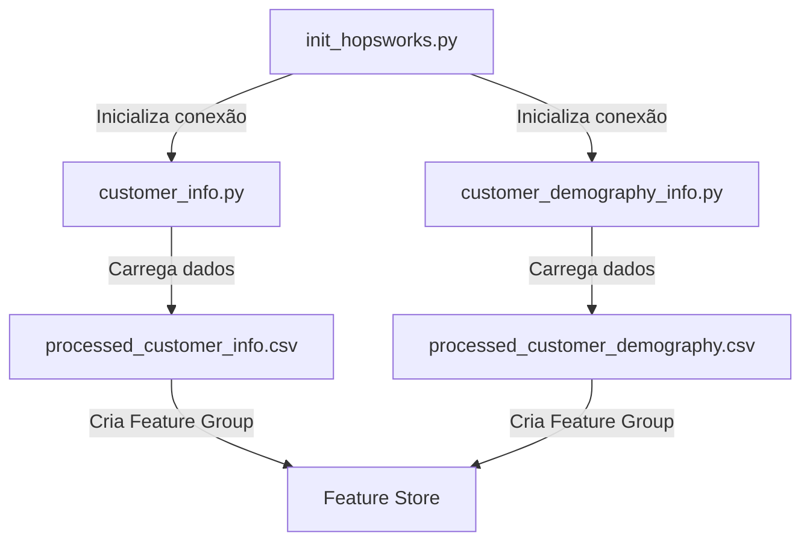

# Hopsworks Feature Store

Este projeto implementa um Feature Store utilizando o Hopsworks para armazenar e gerenciar features de clientes para previsão de churn.

## 🛠️ Tecnologias Utilizadas


## 📋 Pré-requisitos

- Python 3.11.0
- pip
- Conta no Hopsworks
- API Key do Hopsworks

## 🔧 Instalação

1. Clone o repositório:
```bash
git clone https://github.com/seu-usuario/hopsworks_featurestore.git
cd hopsworks_featurestore
```

2. Crie um ambiente virtual:
```bash
python -m venv .venv
source .venv/bin/activate  # No Windows: .venv\Scripts\activate
```

3. Instale as dependências:
```bash
pip install -r requirements.txt
pip install -U 'hopsworks[python]' --quiet
```

4. Configure as variáveis de ambiente:
```bash
cp .env.example .env
```
Edite o arquivo `.env` com suas credenciais do Hopsworks.

## 📊 Estrutura do Projeto

```
Hopsworks_featurestore/
├── data/
│   ├── processed_customer_info.csv
│   └── processed_customer_demography.csv
├── featurestore/
│   ├── __init__.py
│   ├── init_hopsworks.py
│   ├── customer_info.py
│   └── customer_demography_info.py
├── .env
├── .gitignore
├── README.md
└── requirements.txt
```

## 🔄 Fluxo da Solução



## 📝 Descrição dos Scripts

### init_hopsworks.py
- Responsável por inicializar a conexão com o Hopsworks
- Carrega as variáveis de ambiente do arquivo .env
- Autentica com a API Key do Hopsworks
- Retorna o objeto do Feature Store

### customer_info.py
- Cria o feature group para informações básicas do cliente
- Inclui features como:
  - customerID (chave primária)
  - contract
  - tenure
  - paymentmethod
  - paperlessbilling
  - monthlycharges
  - totalcharges
  - churn
  - datetime

### customer_demography_info.py
- Cria o feature group para informações demográficas do cliente
- Inclui features como:
  - customerID (chave primária)
  - gender
  - seniorcitizen
  - dependents
  - partner

## 🚀 Como Usar

1. Execute o script de inicialização:
```bash
python featurestore/init_hopsworks.py
```

2. Crie os feature groups:
```bash
python featurestore/customer_info.py
python featurestore/customer_demography_info.py
```

## 📚 Referências

- [Documentação do Hopsworks](https://docs.hopsworks.ai/)
- [Documentação do Python Feature Store](https://docs.hopsworks.ai/3.0/user_guides/fs/feature_group/python/)